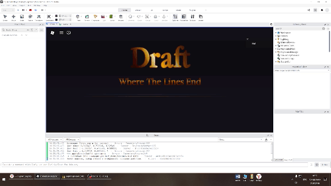
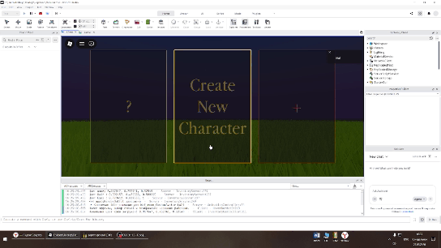
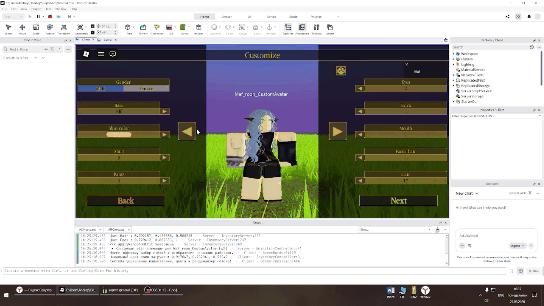
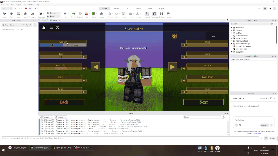
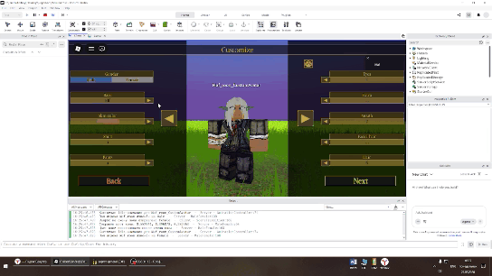
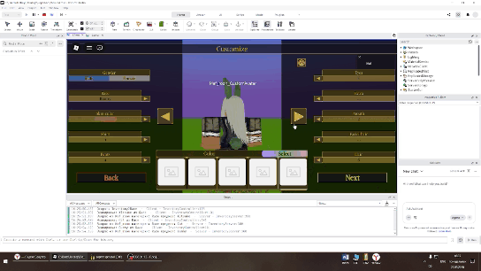
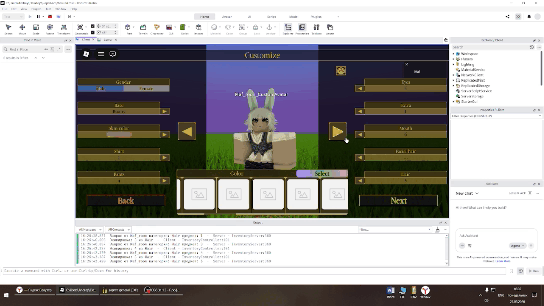
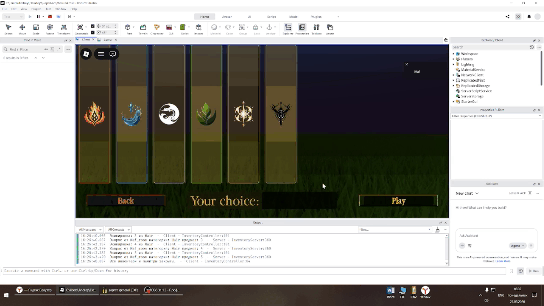
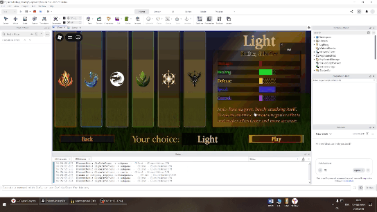

# Создание персонажа и выбор стихии в Roblox

[](https://github.com/Mafroon/roblox-character-creator/actions/workflows/ci.yml)

Исходный код на Luau для лобби создания персонажа в Roblox: настройка пола и расы, 
инвентарь одежды/волос с цветовыми палитрами (кастомный HSV/RGB пикер), 
меню выбора стихии с финальным переходом и телепортация в основную игру.

## Демонстрация

| 1. Экран загрузки | 2. Выбор слота и переход к кастомизации | 3. Работа кнопки рандомайзера |
|:---:|:---:|:---:|
|  |  |  |
| **4. Смена пола** | **5. Смена расы** | **6. Изменение цвета расы** |
|  |  |  |
| **7. Переход к выбору элемента** | **8. Выбор элемента** | **9. Финальный переход в игру** |
|  |  |  |

Управляется как проект [Rojo](https://rojo.space): `default.project.json` 
сопоставляет дерево `src/` с контейнерами Studio, чтобы скрипты синхронизировались 
в реальном времени с активной сессией Studio, в то время как сам GUI создается 
вручную в файле места (place file).

## Возможности

- **Кастомный спавн персонажа** — `CharacterAutoLoads = false`; игрок получает клонированный R15-риг (случайного пола) из `ServerStorage.Gender`, зафиксированный на месте с помощью кастомной анимации ожидания (idle).
- **Полноценный редактор внешности** — инвентари для рубашек / штанов / глаз / рта / волос / растительности на лице / дополнительных элементов / расы, метки экипировки, рандомайзер в один клик с взвешенными вероятностями и цветовые палитры для каждой категории на базе кастомного HSV/RGB `ColorPicker`.
- **Смена пола на месте** — торсы заменяются через `Humanoid:ReplaceBodyPartR15`, цвет кожи сохраняется, а анимация ожидания перезапускается.
- **Меню стихий** — шесть стихий с информационными фреймами, подсветкой при наведении, превью «ваш выбор» и кинематографичным пролетом камеры в финале, который запрашивает телепортацию с выбранной стихией (проверяется по белому списку).
- **Экран загрузки** — переопределение `ReplicatedFirst` с градиентной анимацией и аварийным путем прерывания, который всегда разблокирует сессию.

## Архитектура

Разделение клиент/сервер следует стандартной практике Roblox: логика геймплея и безопасности находится в серверных скриптах (Scripts), вся логика UI — в локальных скриптах (LocalScripts); клиент общается с сервером исключительно через remotes, объявленные в `default.project.json` (они создаются автоматически при свежем подключении Rojo). Сигналы между клиентами используют `BindableEvent`.


```
ReplicatedStorage (ModuleScripts + remotes)
├─ ColorPicker          класс HSV/RGB пикера (слайдеры на основе событий)
├─ ColorPalettes        общие палитры для серверного и клиентского рандомайзеров
├─ SceneEffects         твины показа/скрытия меню + риг горизонтального вращения камеры
├─ InventoryController  инвентари, палитры, метки экипировки, рандомайзер
└─ ElementMenu          информационные фреймы стихий + общая конфигурация ELEMENTS

ServerScriptService
├─ ReplaceAvatarWithRig кастомный спавн R15 (CharacterAutoLoads = false)
├─ InventoryServer      экипировка/снятие, расы, перекраска, стартовый наряд
├─ MaleFemale           смена пола (ReplaceBodyPartR15, цвет кожи сохраняется)
├─ Teleport             телепортация по белому списку с SetTeleportData
├─ PlayerDataManager    состояние для каждого игрока (цвета кожи) — заменяет _G
├─ AnimationController  повтор анимации ожидания, используемый скриптами выше
└─ RigParts             имена частей тела R15 для перекраски кожи

ReplicatedFirst
└─ LoadingScript        кастомный экран загрузки + рукопожатие (handshake) StartGameEvent

StarterGui
├─ HoverBorder          границы кнопок с тегами CollectionService
├─ MainMenuGui          CameraLockScript, SlotHover (эффекты наведения Slot1–3),
│                       SceneTransition — клиентский оркестратор
├─ ElementMenuGui       HoverBorder2 — выбор стихии → ElementChosenEvent
└─ CreationMenuGui      RotateScript — вращение персонажа на подиуме
```

Каждый скрипт начинается с заголовочного комментария, описывающего его назначение, зависимости и контракт взаимодействия с соседними скриптами.

### Примечания по безопасности

Все клиент→серверные remotes проверяют свои аргументы по белым спискам: категории экипировки/цвета (`VALID_EQUIP_CATEGORIES`), стихии для телепортации
(`VALID_ELEMENTS`), и пол (`"male"/"female"`). Выбранная стихия отправляется в место назначения через
`TeleportOptions:SetTeleportData({ element = ... })`.

## Установка

Требования: набор инструментов [Rokit](https://github.com/rojo-rbx/rokit) (версия Rojo 7.6.1 зафиксирована в `rokit.toml`) и Roblox Studio.

```bash
git clone <этот репозиторий>
cd rb_scripts
rokit install          # устанавливает зафиксированную версию Rojo
rojo serve             # запускает сервер синхронизации (порт 34872)
```

Затем в Studio: откройте ваше место (place) → Плагины (Plugins) → Rojo → Подключиться (Connect). Все скрипты и remotes появятся в DataModel; дальнейшие правки в `src/**` будут синхронизироваться в реальном времени (hot-sync).

### Ожидаемое содержимое места (создается вручную, отсутствует в этом репозитории)

| Экземпляр | Назначение |
|---|---|
| `ServerStorage.Gender.Male` / `.Female` | шаблоны R15-ригов |
| `ServerStorage.Animations.Idle` | объект `Animation` с валидным `AnimationId` |
| `ServerStorage.Race.<RaceName>` | папки с аттачментами рас |
| `ServerStorage.Shirt/Pants/Eyes/...` | папки предметов по категориям |
| `ReplicatedStorage.Templates.InventoryItemTemplate` | шаблон ячейки инвентаря |
| `StarterGui` GUIs | `MainMenuGui`, `CreationMenuGui`, `ElementMenuGui`, `EntranceGui` |
| `ReplicatedFirst.LoadingScreen` | шаблон экрана загрузки |

ID места назначения жестко прописан в
`src/ServerScriptService/Teleport.server.luau` (`GAME_PLACE_ID`).

## Соглашения

- Исходный код в кодировке **UTF-8 with CRLF**; комментарии и сообщения логов написаны на русском языке. Git хранит их побайтово (`*.luau -text` in
  `.gitattributes`).
- Общее состояние между серверными скриптами передается через ModuleScripts
  (`PlayerDataManager`, `AnimationController`) — `_G` не используется.
- Именование для Rojo: `*.server.luau` → `Script`, `*.client.luau` →
  LocalScript, `*.luau` → ModuleScript. Новые общие модули также должны быть объявлены в `default.project.json`.

## Лицензия

[MIT](LICENSE) — свободное использование с указанием авторства.
